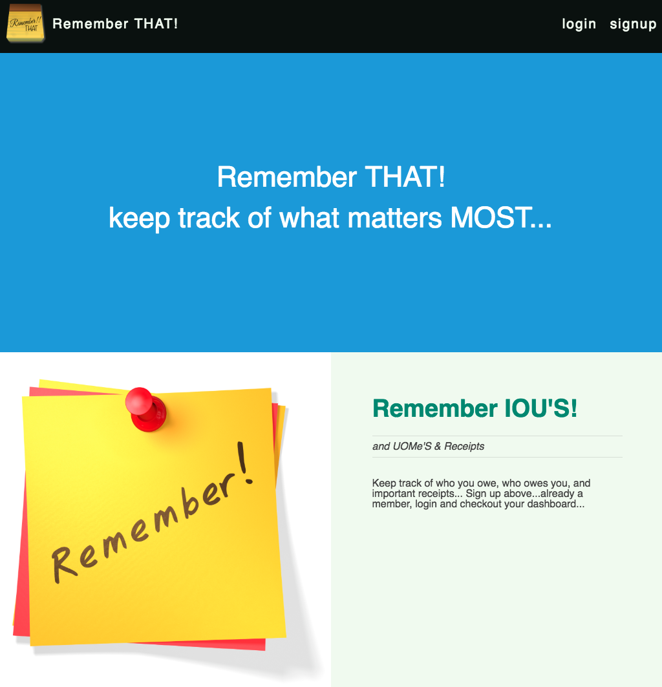
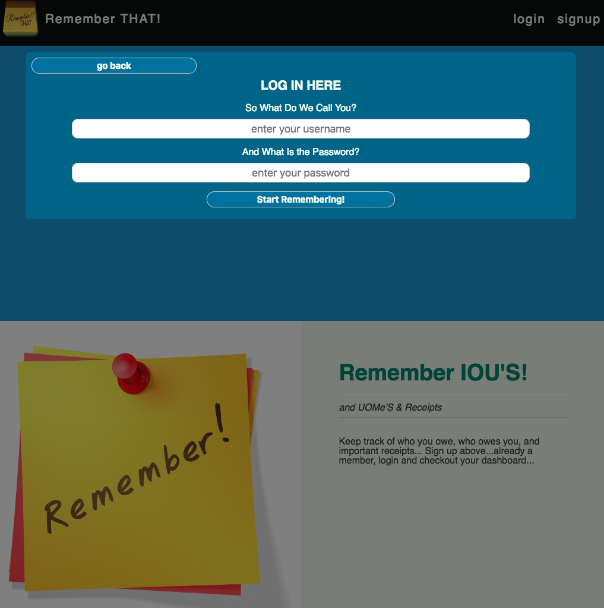
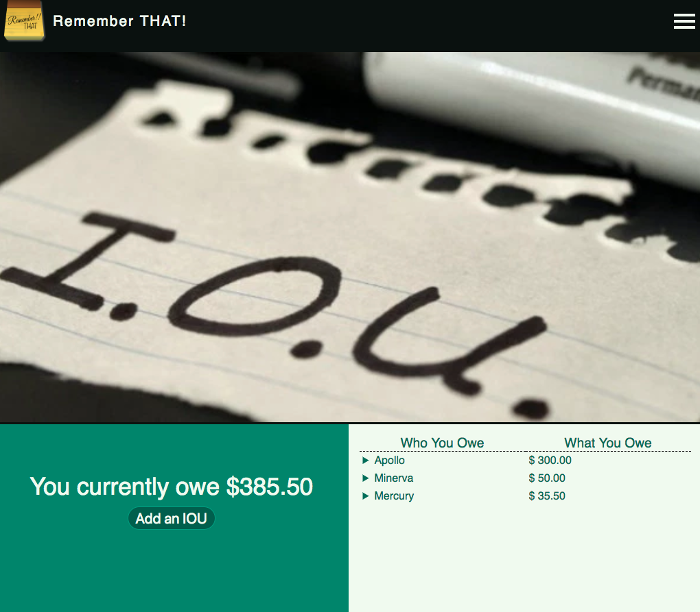
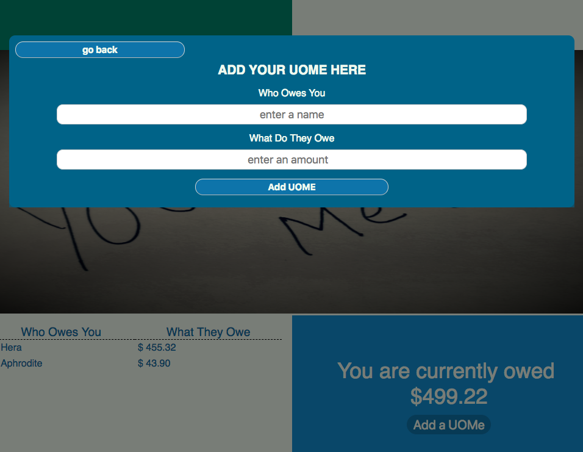
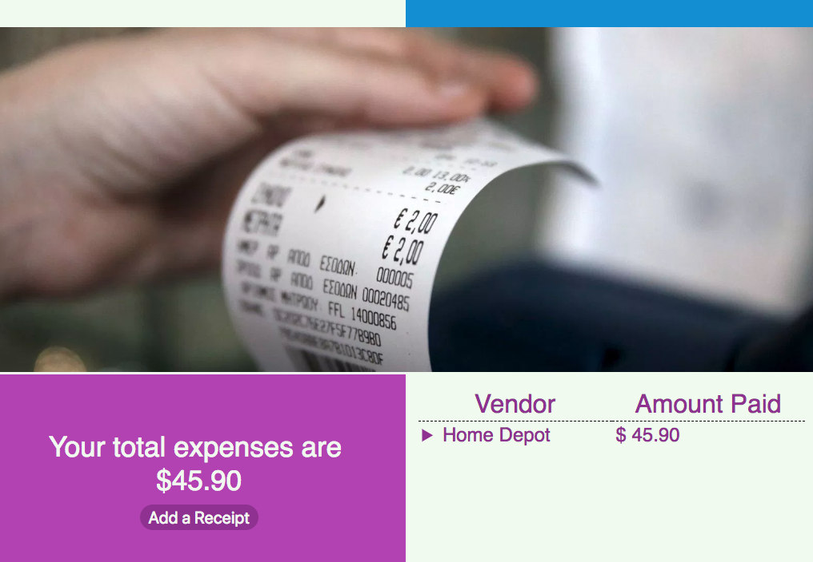

# Remember THAT App
## https://rememberthat.netlify.com/
## Description

Remember THAT! is a web application that gives prospective users a platform to keep track of IOU's (who a particular user owes money to), UOMe's (who owes a particular user money), and Receipts (from a particular user collection).  Users can:
- Login and signup via JWT authentication to ensure security
- Store their own IOU's, UOMe's, and Receipts in their own accounts
- Manage their own IOU's, UOMe's and Receipts in their own accounts

## Code Base

### DATABASE
Remember THAT! stores information using the MONGO DATABASE.  All IOU's, UOMe's, and Receipts, are collections of the remember-that database and references the user by id.

### SERVER
The server is built using NODE.  The collection of modules used for this project include the following:
- bcryptjs - for hashing passwords
- cors - for cross-origin resource handling
- dotenv - for handling environment variables
- express - for handling most of the server operations
- mongoose - the ORM for he Mongo DB
- passport (passport-local, passport-jwt) - for JWT authentication
### CLIENT
The client-side to this application was built using the REACT architecture.  In conjuction with REACT, this app also utilizes modules to assist with routing, jwt persistence across sessions, form handling, and much more.  The collection of modules used for this project include the following:
- jwt-decode - for decoding jwt tokens
- react-dom - for rendering components to the DOM
- redux - for managing state via actions, reducers, and the store
- react-redux - for connecting components to redux, allowing them access to redux methods
- react-router-dom - for routing components to specific paths
- redux-thunk - for handling asynchronous actions
- redux-form - for handling forms

## SCREENSHOTS

